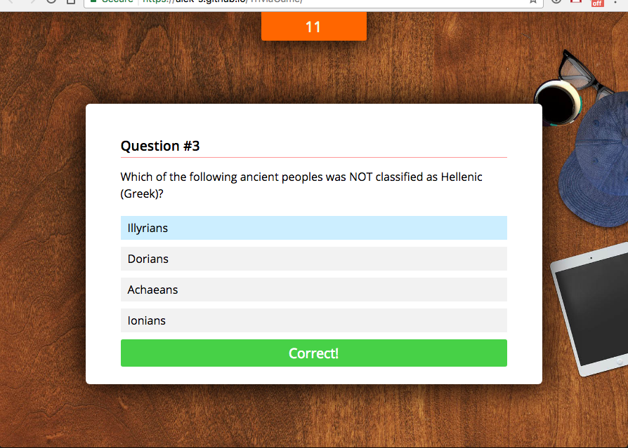
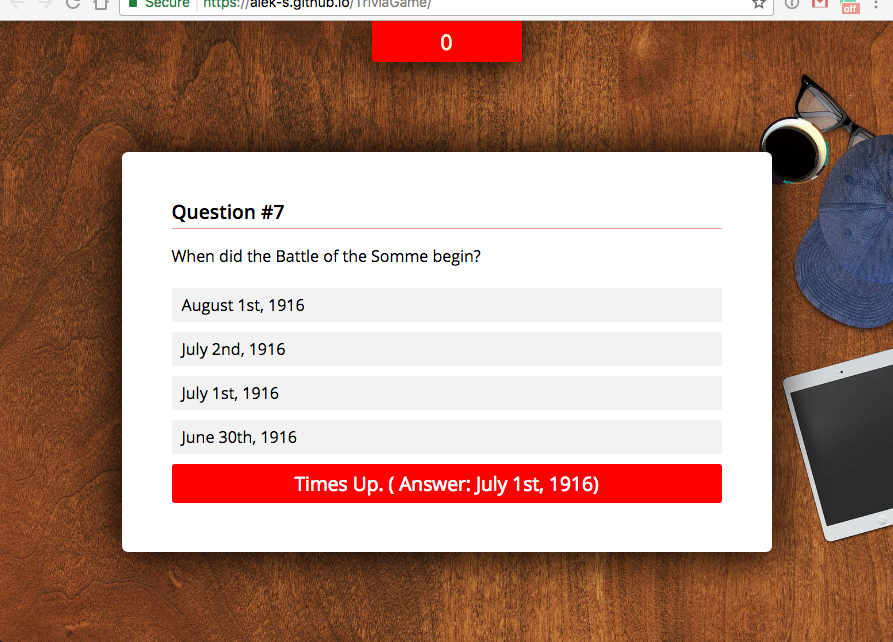
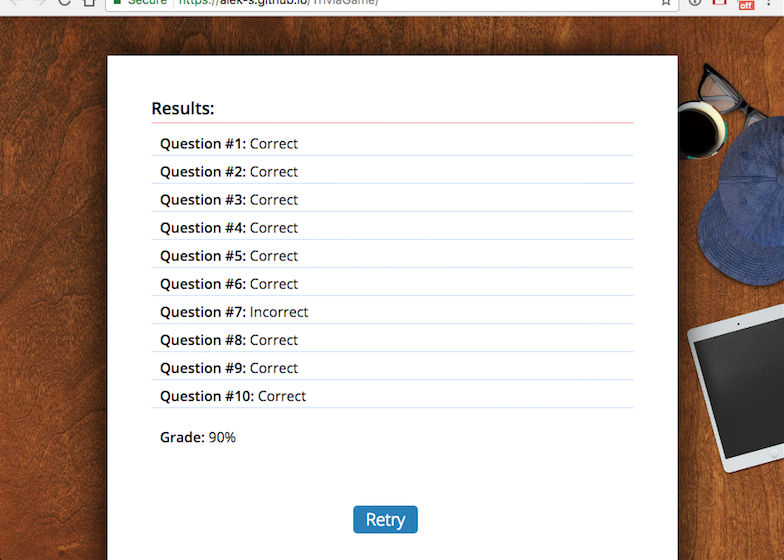

# History Class Simulator

Recreate the nostalgic childhood stress of a timed multiple choice examination. It's the public school testing simulator you never asked for!

When the game begins, you will be given ten multiple choice questions. Each question will have a time limit within which an answer must be submitted. When the test has been completed, your results will be presented.

#### Tools of the Trade
* jQuery
* XHR / Ajax request (opentdb.com)
* Timers (setTimeout(), setInterval())
* Custom CSS (pseudo-classes, transitions)
* Google Fonts 

#### Try It Now: [Page Link](https://alek-s.github.io/TriviaGame/)
---

## Correct Answer
Notification within game card that user answered correctly. Pause for three seconds, and proceed to next question.

## Incorrect Answer
If answered incorrectly, or time runs out, notification within game card showing what the correct answer should have been. Pause for three seconds, and proceed to next question.

## Report Card
After ten questions, present the cumalative results and percent answered correctly.

